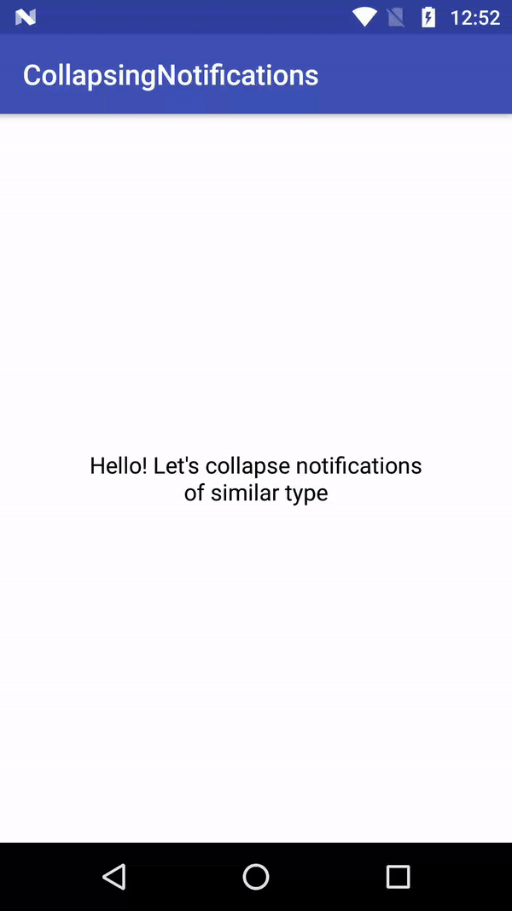
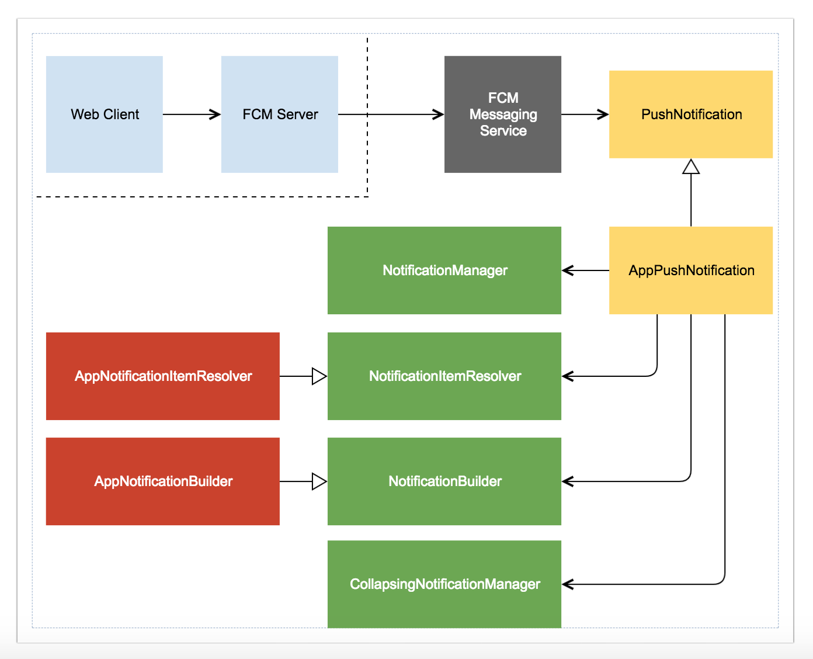
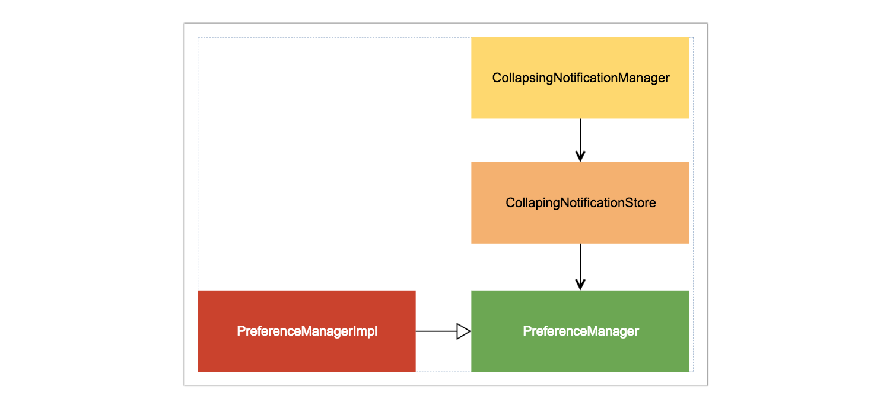

# collapsing-notifications

Collapsing Notifications implements the best practices to handle and collapse FCM notifications.

##AppPushNotification

(AppPushNotification)[./app/src/main/java/com/fueled/collapsingnotifications/notification/AppPushNotification.kt] is responsible for resolving [PushNotificationItem](./app/src/main/java/com/fueled/collapsingnotifications/core/PushNotificationItem.kt). It also decides when to show/hide a notification. Here’s the flow:

##CollapsingNotificationManager

(CollapsingNotificationManager)[.app/src/main/java/com/fueled/collapsingnotifications/notification/CollapsingNotificationManager.kt] is one of the dependencies injected in AppPushNotification which manages collapsing of notifications.

1. Notifications will collapse based on `collapse_key` from RemoteMessage. Ergo, you should be sending a [payload](https://gist.github.com/chetdeva/42002ae33225173b713e097bb564835a) with a `collapse_key`.
2. When the first notification (of say `type_a`) is triggered, the usual notification will be shown.
3. When second notification (of say type_a) is triggered, it is added to the queue and if the size of this list of `type_a` notification is greater than 1, flag `shouldCollapse` is set to `true`.
4. Hence, the previous notification is cleared and the collapsing text will be shown based on the type. In this case, it will be “You have 2 notifications of Type-A”.
5. Similar steps will be followed for `type_b` notifications and so on.
6. When user taps on or dismisses this notification from Notification Tray, this list of `type_a` notifications cleared. `MainActivity` handles the tap whereas `NotificationDismissTracker` takes care of dismissal.

##Reference

[Android Notifications — An elegant way to build and display](https://android.jlelse.eu/android-notifications-an-elegant-way-to-build-and-display-7771d65ba3a2)

